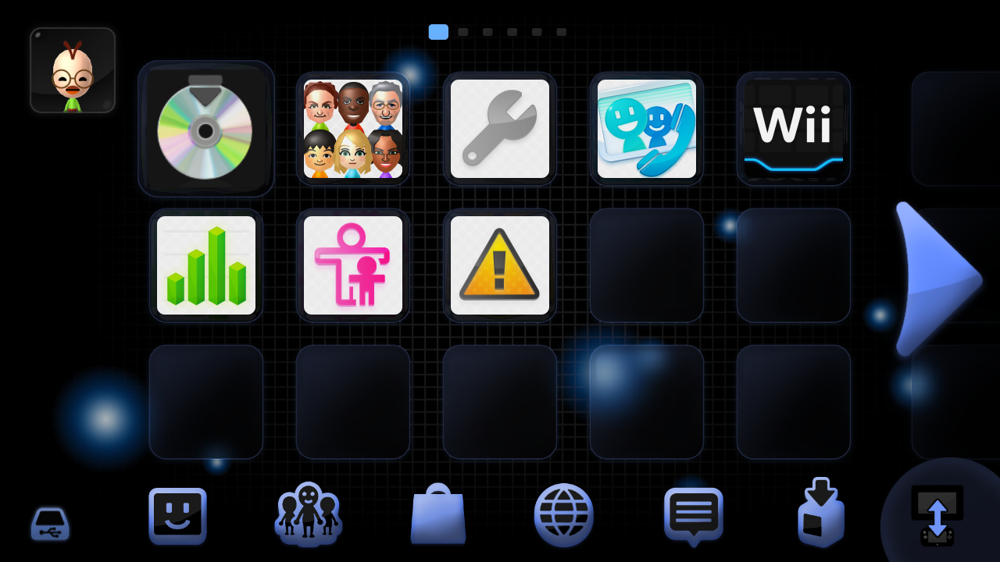

[Go back](../index.md){ .md-button }

!!! quote ""

    { align=right width=500 }

    # Project: Dolphin

    ### Made by: Author Name(s)

    Heavily inspired by Extrem's HBC theme. Check it out: 
     <https://wiibrew.org/wiki/Homebrew_Channel/Themes> (Nintendo Dolphin) 
     
    Music: GameCube System Music

    [Download](https://drive.google.com/file/d/1iKxORs3Q-YfTBiAfWweTGi5qpxWpgkOD/view?usp=sharing){ .md-button .md-button--primary }

  <video width="500" controls>
    <source src="preview.mp4" type="video/mp4">
  </video>
  
  

 
