---
hide:
    - navigation
    - toc
---

## WIP NOT FINAL

<input type="text" id="searchBar" placeholder="Search animated themes..." oninput="filterCards()" style="width: 100%; padding: 8px; ">

<select id="sortMode" onchange="sortCards()" style="width: 100%; padding: 8px; border-radius: 6px;">
<option value="newest">Sort by: Newest First</option>
<option value="az">Sort by: A → Z</option>
<option value="za">Sort by: Z → A</option>
</select>

                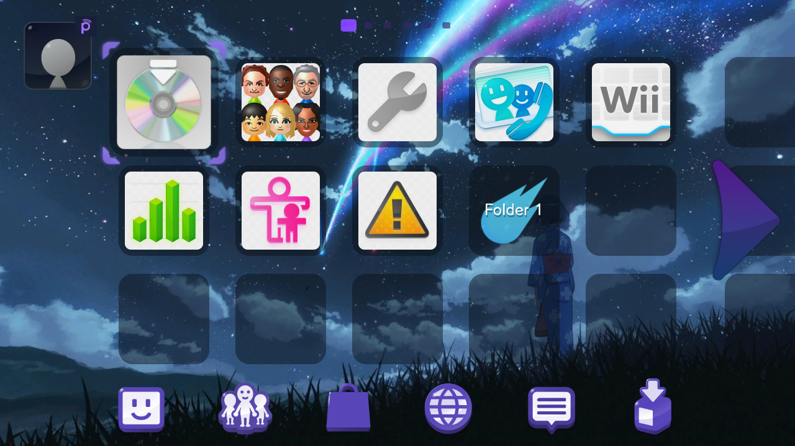
                
<b>Your Name</b>

                
Made by: Dewgong

            

            

                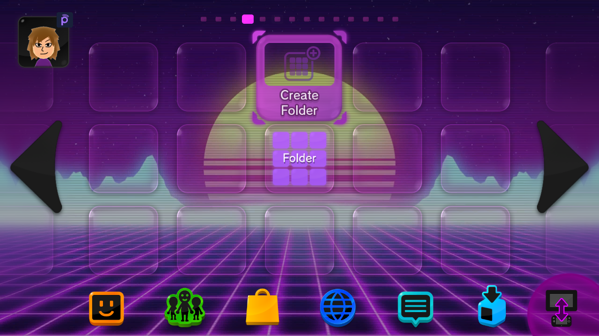
                
<b>Vaporwave</b>

                
Made by: Gatto

            

            

                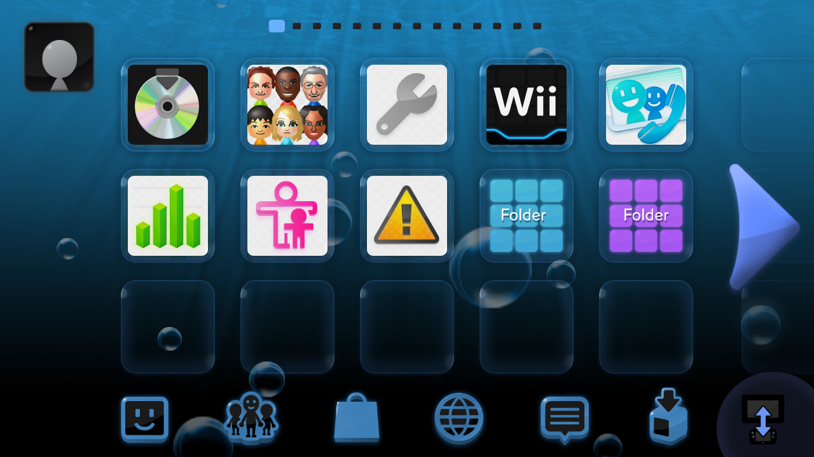
                
<b>The Homebrew Channel</b>

                
Made by: Gatto

            

            

                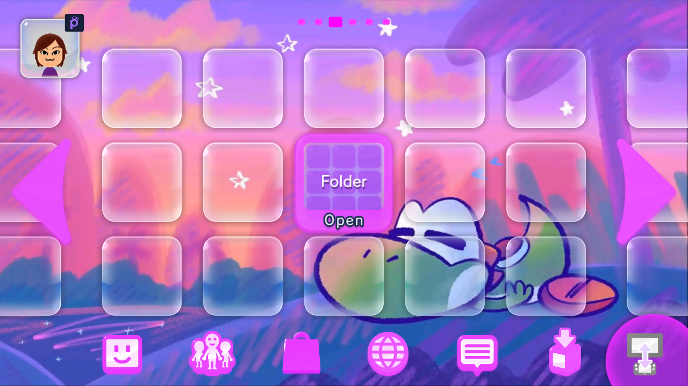
                
<b>Sleepy Yoshi</b>

                
Made by: Gatto

            

            

                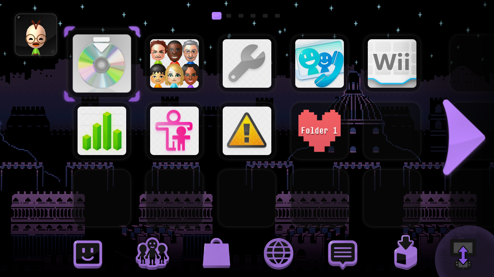
                
<b>Ruins - Undertale</b>

                
Made by: Dewgong

            

            

                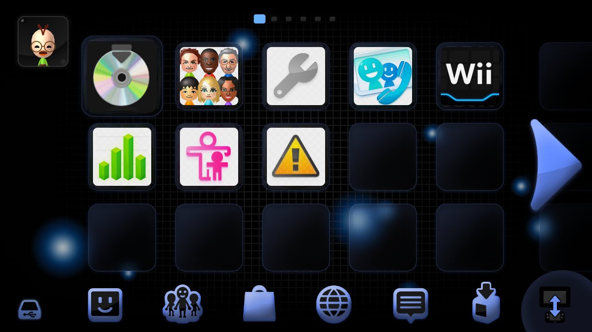
                
<b>Project: Dolphin</b>

                
Made by: Author Name(s)

            

            

                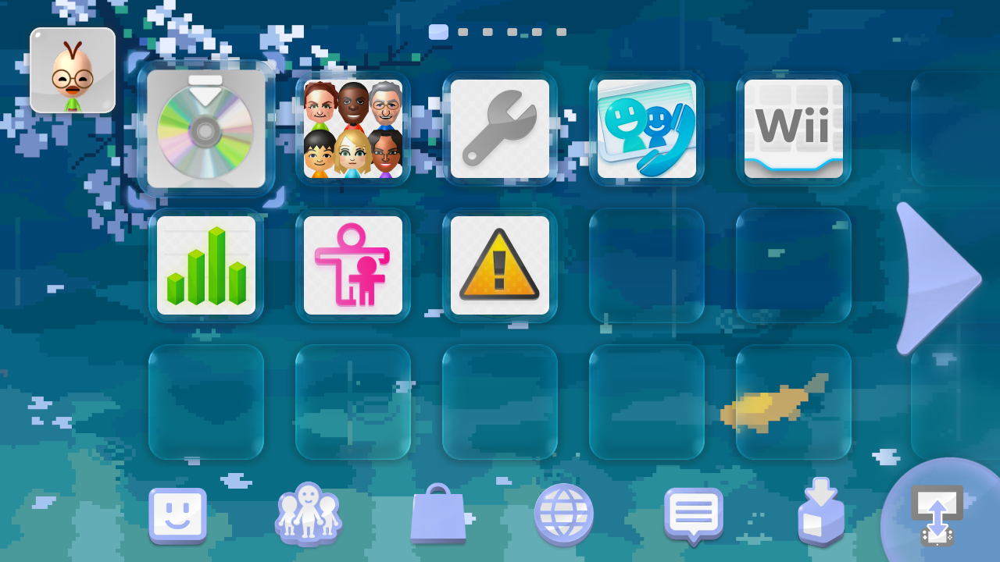
                
<b>Peaceful Koi</b>

                
Made by: Dewgong

            

            

                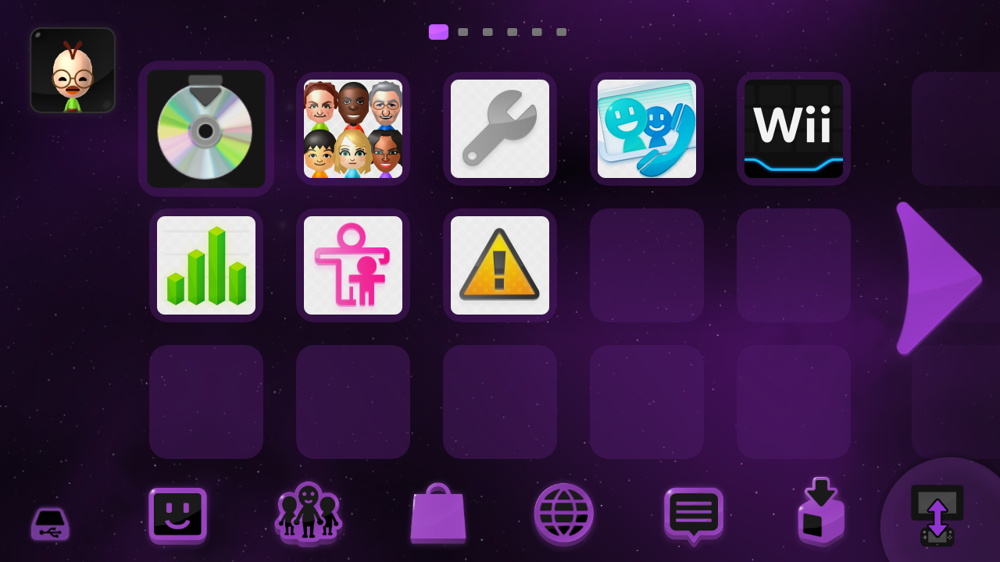
                
<b>Nebula</b>

                
Made by: Dewgong

            

            

                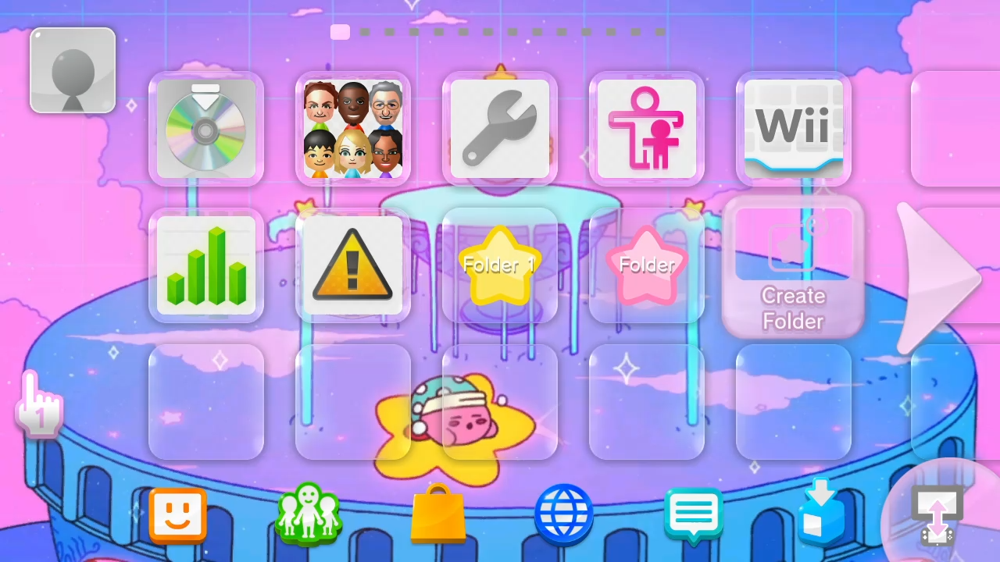
                
<b>Fountain Of Dreams (Kirby)</b>

                
Made by: Gatto

            

            

                
                
<b>Digital Rain</b>

                
Made by: Dewgong

            

            

                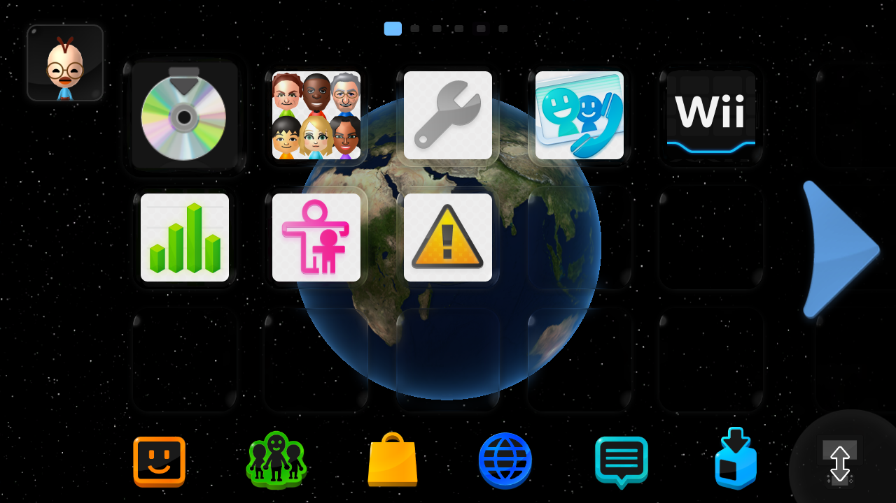
                
<b>Deep Space</b>

                
Made by: Dewgong

            

            

                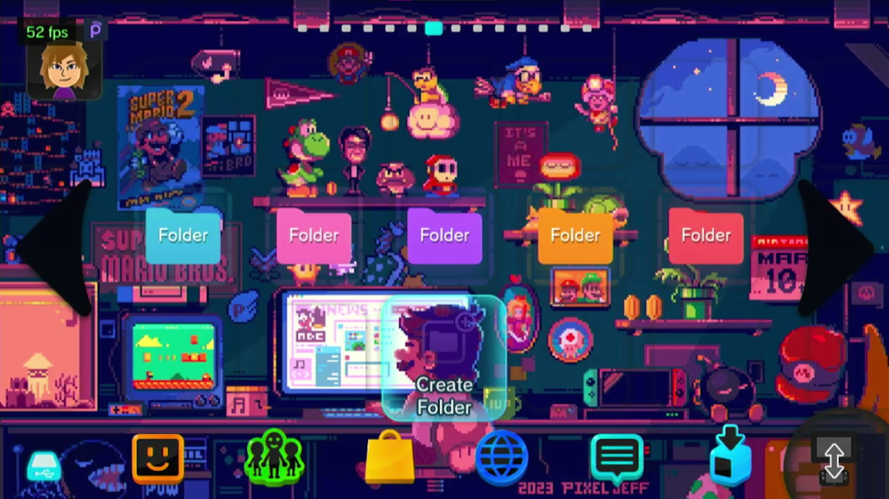
                
<b>Chill Pixel Mario</b>

                
Made by: Gatto

            

            

